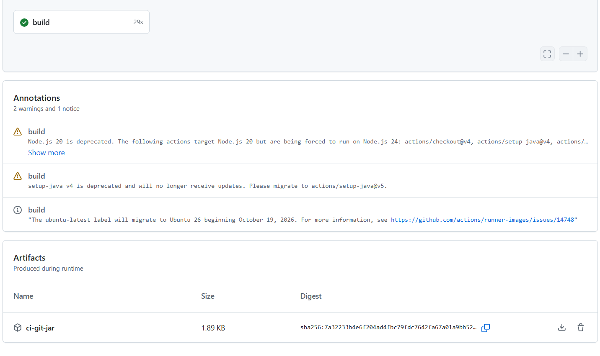
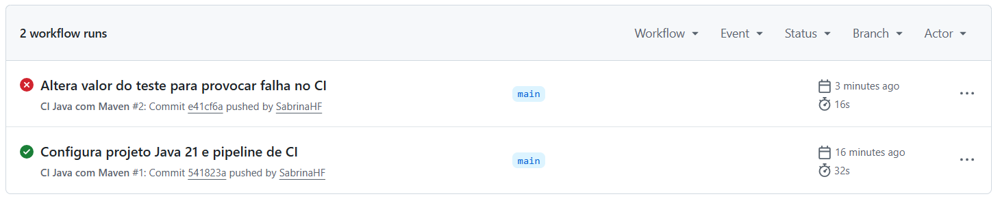
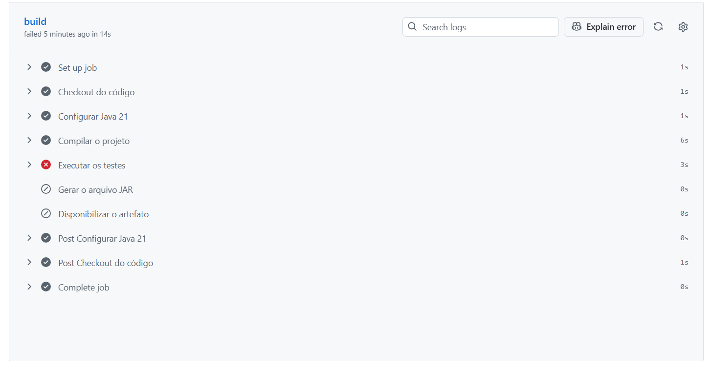
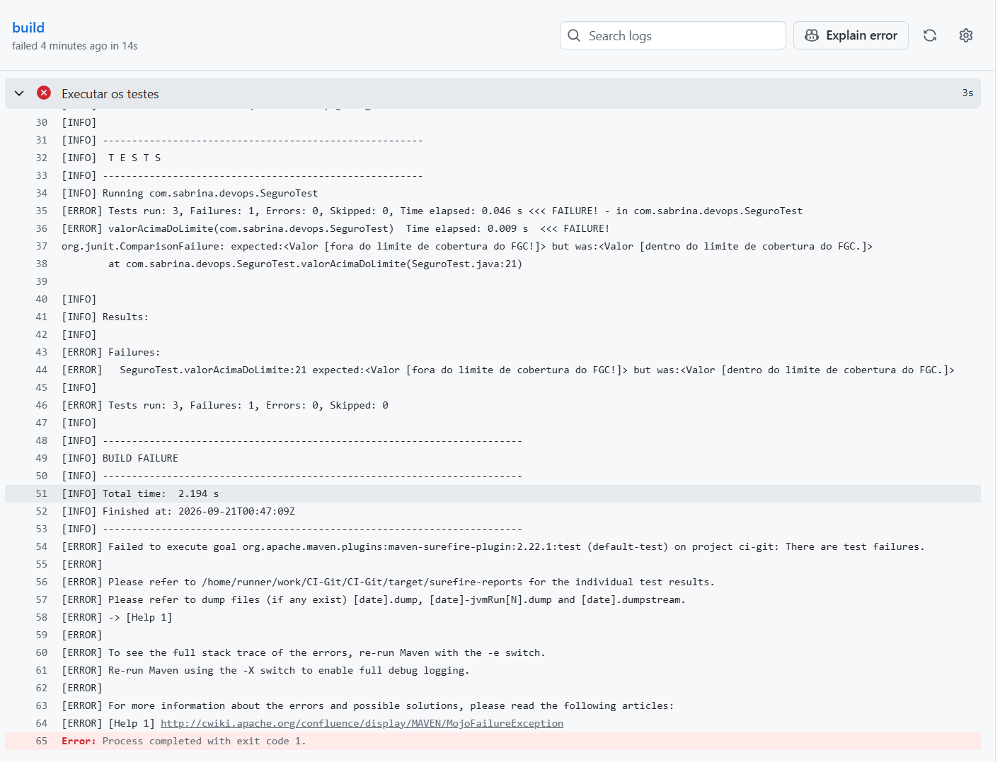

# Projeto Java com Integração Contínua

Projeto desenvolvido em Java 21 com Maven para demonstrar, na prática, o funcionamento de uma pipeline de Integração Contínua utilizando GitHub Actions.


# Funcionalidade

A aplicação verifica se um valor está dentro do limite de R$ 250.000 adotado no projeto, tendo como referência o limite de cobertura do Fundo Garantidor de Créditos (FGC).

A validação considera as seguintes situações:

* valor negativo: considerado inválido;
* valor entre R$ 0 e R$ 250.000: dentro do limite de cobertura;
* valor acima de R$ 250.000: fora do limite de cobertura.

A funcionalidade está implementada na classe `Seguro`.

# Tecnologias utilizadas

* Java 21;
* Maven;
* JUnit;
* Git;
* GitHub Actions.

# Testes unitários

Foram implementados três cenários de testes:

1. valor abaixo do limite de cobertura;
2. valor acima do limite de cobertura;
3. valor negativo.

Para executar os testes localmente:

```bash
mvn clean test
```

# Pipeline de Integração Contínua

A pipeline está configurada no arquivo:

```text
.github/workflows/ci.yml
```

A cada `push`, são executadas automaticamente as seguintes etapas:

1. checkout do código;
2. configuração do Java 21;
3. compilação do projeto;
4. execução dos testes unitários;
5. geração do arquivo JAR;
6. disponibilização do JAR como artefato.

# Evidências

### Pipeline concluída com sucesso




### Histórico das execuções




### Pipeline com falha proposital




O registro detalhado demonstra a execução de três testes, com uma falha no cenário `valorAcimaDoLimite`.



